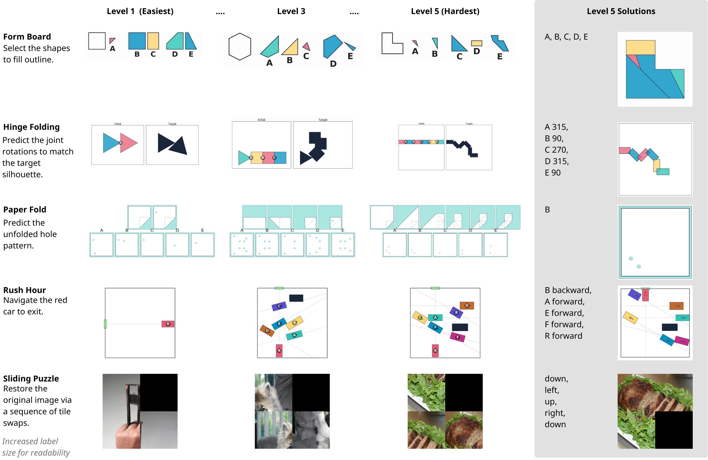
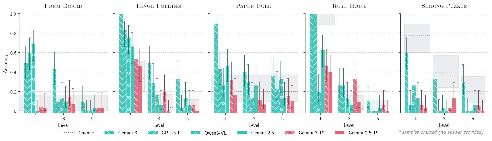
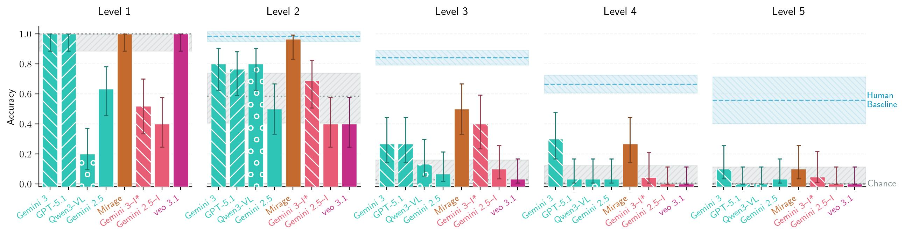
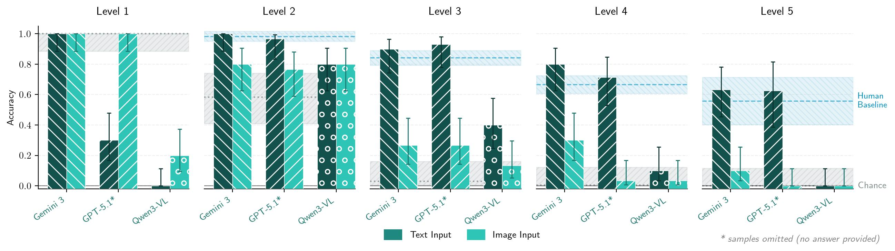
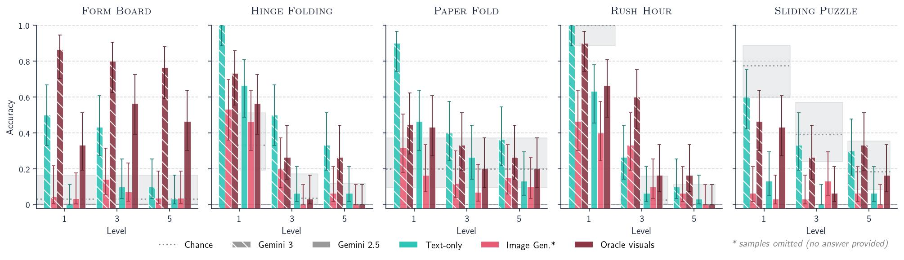

# MentisOculi: Revealing the Limits of Reasoning with Mental Imagery

<p align="center">
  <a href="https://arxiv.org/abs/2602.02465"></a>
  <a href="https://jana-z.github.io/mentis-oculi"></a>
</p>

<p align="center">
  <strong>Jana Zeller</strong><sup>1,2,3</sup>, 
  <strong>Thaddäus Wiedemer</strong><sup>1,2</sup>, 
  <strong>Fanfei Li</strong><sup>3</sup>, 
  <strong>Thomas Klein</strong><sup>1,2</sup>, 
  <strong>Prasanna Mayilvahanan</strong><sup>1,2</sup>,<br>
  <strong>Matthias Bethge</strong><sup>1,2,4</sup>, 
  <strong>Felix Wichmann</strong><sup>4</sup>, 
  <strong>Ryan Cotterell</strong><sup>3</sup>, 
  <strong>Wieland Brendel</strong><sup>1,2</sup>
</p>

<p align="center">
  <sup>1</sup>MPI for Intelligent Systems &nbsp;
  <sup>2</sup>ELLIS Institute Tübingen &nbsp;
  <sup>3</sup>ETH Zurich &nbsp;
  <sup>4</sup>University of Tübingen
</p>

---

<p align="center">
  
</p>

**MentisOculi** is a procedural, stratified benchmark suite designed to evaluate visual reasoning capabilities in frontier AI models. The benchmark comprises five visual reasoning tasks that are best solved with mental imagery, requiring models to form, maintain, and manipulate visual representations in a goal-oriented manner.

## Abstract

Frontier models are transitioning from multimodal large language models (MLLMs) that merely ingest visual information to unified multimodal models (UMMs) capable of native interleaved generation. This shift has sparked interest in using intermediate visualizations as a reasoning aid, akin to human mental imagery. Central to this idea is the ability to form, maintain, and manipulate visual representations in a goal-oriented manner.

To evaluate and probe this capability, we develop **MentisOculi**, a procedural, stratified suite of multi-step reasoning problems amenable to visual solution, tuned to challenge frontier models. Evaluating visual strategies ranging from latent tokens to explicit generated imagery, we find they generally fail to improve performance. Analysis of UMMs specifically exposes a critical limitation: While they possess the textual reasoning capacity to solve a task and can sometimes generate correct visuals, they suffer from compounding generation errors and fail to leverage even ground-truth visualizations.

Our findings suggest that despite their inherent appeal, visual thoughts do not yet benefit model reasoning. MentisOculi establishes the necessary foundation to analyze and close this gap across diverse model families.

## Key Findings

### Finding 1: MentisOculi is far from saturated

<p align="center">
  
</p>

MLLMs and UMMs display similar failure patterns. Performance degrades consistently with difficulty and falls below chance at Level 5, highlighting fundamental limitations of current state-of-the-art models in solving multi-step visual reasoning tasks.

---

### Finding 2: Explicit visual thought is currently ineffective

<p align="center">
  
</p>

We find no evidence that self-generated imagery improves text-only reasoning. Latent visual reasoning (Mirage) offers only brittle gains, while UMMs often underperform their text-only counterparts. Video models fail rapidly as complexity increases.

---

### Finding 3: Models possess the *competence* to solve the tasks

<p align="center">
  
</p>

When prompted with a precise text transcription rather than an image, MLLMs like Gemini 3 and GPT-5 can solve RushHour on par with humans. This proves that the failure stems from visual processing and planning, not a lack of logical reasoning capacity.

---

### Why do UMMs fail? A dual issue

<p align="center">
  
</p>

Visual reasoning suffers from *generation errors* (producing incorrect images) and *interpretation errors* (failing to use correct images). Even when provided with correct "oracle" visuals, models often fail to use them as actionable evidence. This suggests current architectures cannot yet effectively bridge the gap between generation and reasoning.

## Benchmark Tasks

MentisOculi comprises five visual reasoning tasks designed to require mental imagery:

| Task | Description | Reasoning Type |
|------|-------------|----------------|
| **Form Board** | Match pieces to silhouettes | Spatial matching |
| **Hinge Folding** | Fold connected shapes via hinges | Sequential transformations |
| **Paper Fold** | Predict fold patterns | Spatial prediction |
| **Rush Hour** | Slide cars to free the red car | Sequential planning |
| **Sliding Puzzle** | Rearrange tiles to form image | Sequential moves |

Each task is procedurally generated across **5 difficulty levels** (1-5), scaling with the number of reasoning steps required. See the [datasets/](datasets/) folder for detailed documentation.

## Repository Structure

```
mentis-oculi/
├── datasets/                    # Benchmark datasets and generators
│   ├── form-board/             # Form Board puzzle generator
│   ├── hinge-folding/          # Hinge Folding puzzle generator
│   ├── paper-fold/             # Paper Fold puzzle generator
│   ├── rushhour/               # Rush Hour puzzle generator
│   ├── sliding-puzzle/         # Sliding Puzzle generator
│   ├── generate_all_datasets.sh # Generate all datasets
│   └── README.md               # Dataset documentation
├── docs/                        # Project website
└── README.md                    # This file
```

## Getting Started

### Prerequisites

- Python 3.10+
- [uv](https://github.com/astral-sh/uv) (recommended) or pip

### Installation

```bash
git clone https://github.com/Jana-Z/mentis-oculi.git
cd mentis-oculi
```

### Generate Datasets

Each dataset can be generated independently:

```bash
cd datasets/<task-name>
uv sync  # or: pip install -r requirements.txt
uv run main.py --help
```

Or generate all datasets at once:

```bash
cd datasets
./generate_all_datasets.sh
```

### Evaluate Model Responses

Each dataset includes an evaluation script:

```bash
uv run evaluate_responses.py --responses path/to/responses.json
```

See [datasets/README.md](datasets/README.md) for the expected input format.

## Citation

If you use MentisOculi in your research, please cite our paper:

```bibtex
@article{zeller2026mentisoculi,
  title={{MENTISOCULI}: Revealing the Limits of Reasoning with Mental Imagery},
  author={Zeller, Jana and Wiedemer, Thadd{\"a}us and Li, Fanfei and Klein, Thomas and Mayilvahanan, Prasanna and Bethge, Matthias and Wichmann, Felix and Cotterell, Ryan and Brendel, Wieland},
  journal={arXiv preprint arXiv:2602.02465},
  year={2026}
}
```

## Links

- **Paper**: [arXiv:2602.02465](https://arxiv.org/abs/2602.02465)
- **Project Page**: [jana-z.github.io/mentis-oculi](https://jana-z.github.io/mentis-oculi)
- **Datasets**: [datasets/](datasets/)
