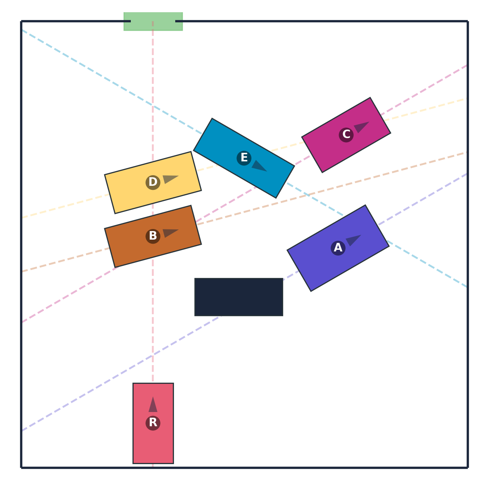

# Rush Hour Variant: Visual Reasoning Benchmark

This benchmark extends the <a href="https://en.wikipedia.org/wiki/Rush_Hour_(puzzle)">Rush Hour</a> puzzle to defeat ASCII shortcuts and require true visual manipulation. We replace strictly axis-aligned rectangular cars on a grid with richer, physically plausible objects that translate along fixed local axes and are initialized at non-axis-aligned orientations, increasing the need for mental imagery and multi-step visual reasoning.

### Example Puzzle



*Example puzzle showing vehicles in a parking lot. The red car (R) must reach the green exit by moving other vehicles out of the way. Each vehicle can only move forward or backward along its axis.*

## What the task is

At a high level, the puzzle is to clear a path so the red car can reach an exit. Each vehicle is constrained to move only by translating forward or backward along its own local axis; rotations are not allowed. To make the reasoning requirements explicit, the benchmark renders each vehicle’s allowable drive direction as a thin "rail" overlay and, in the visual chain-of-thought, plots the actual path the red car traverses as it heads to the exit.

## Output Format

```
output/
├── level_01/                       # Difficulty level 1
│   ├── level_metadata.json         # Level-specific metadata
│   ├── puzzle_0001/
│   │   ├── initial.png             # Initial puzzle state
│   │   ├── cot_00.png              # Chain-of-thought step 1
│   │   ├── cot_01.png              # Chain-of-thought step 2 (if needed)
│   │   ├── text_description.txt    # Text description of the puzzle
│   │   └── metadata.json           # Puzzle metadata
│   ├── puzzle_0002/
│   │   └── ...
│   └── ...
├── level_02/                       # Difficulty level 2
│   └── ...
└── ...
```

### metadata.json (per puzzle)

```json
{
  "puzzle_id": 1,
  "level": 1,
  "num_cot_images": 2,
  "num_actions": 2,
  "seed": 42,
  "initial_state_image": "initial.png",
  "cot_images": ["cot_00.png", "cot_01.png"],
  "board": {"width": 10.0, "height": 10.0, "exits": [...]},
  "objects": [
    {"id": "red_car", "shape": "rectangle", "size": [1.8, 0.9], "pose": {...}, "local_axis": [...], "movable": true},
    ...
  ],
  "actions": [
    {"object_id": "A", "direction": 1, "distance": 2.5},
    {"object_id": "red_car", "direction": -1, "distance": 8.1}
  ],
  "solution_length": 2
}
```

## Difficulty Levels

The complexity of Rush Hour puzzles is controlled by the **number of CoT images** (intermediate steps). Each action produces one CoT image showing the state after that move:

| Level | CoT Images | Actions | Output Directory | Description |
|-------|------------|---------|------------------|-------------|
| **1** | 1 | 1 | `output/level_01` | Just move red car to exit |
| **2** | 2 | 2 | `output/level_02` | Move 1 blocker + red car |
| **3** | 3 | 3 | `output/level_03` | Move 2 blockers + red car |
| **4** | 4 | 4 | `output/level_04` | Complex multi-blocker |
| **5** | 5 | 5 | `output/level_05` | Extended planning |

**Note**: Level = number of CoT images = number of actions. Each action produces one intermediate state image showing the result of that move.


## Usage

### Generate Per-Level Datasets

```bash
# Generate all levels (1-5), 50 instances each
uv run main.py --instances 50 --seed 42

# Generate specific level only
uv run main.py --instances 50 --level 3 --output-dir output/level_03 --seed 42

# Generate custom range of levels
uv run main.py --instances 50 --min-level 2 --max-level 4 --seed 42

# Or use the repository-wide generation script:
cd .. && ./generate_all_datasets.sh --task rushhour
```

### Command-Line Options

| Option | Type | Default | Description |
|--------|------|---------|-------------|
| `--instances` | int | 50 | Instances per level |
| `--seed` | int | 42 | Base random seed |
| `--level` | int | None | Generate only this specific level |
| `--min-level` | int | 1 | Minimum level (when not using --level) |
| `--max-level` | int | 5 | Maximum level (when not using --level) |
| `--max-attempts` | int | 5000 | Max generation attempts per level |
| `--output-dir` | str | output | Base output directory |


