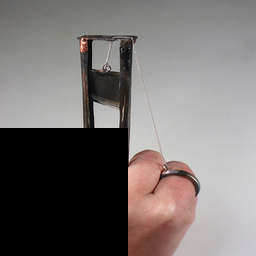

# Sliding Puzzle Generator

Generate sliding tile puzzles where a scrambled image must be reconstructed through sequential tile movements.

## Overview

This generator creates visual reasoning puzzles where:
- A natural image is divided into an **n×n grid** of tiles (default: 2×2)
- One tile is replaced by a **blank space** (black) at a **randomly sampled position**
- The puzzle is **scrambled** and verified with BFS to ensure the solution is **optimal**
- The task is to **reconstruct the original image** through valid tile movements
- Each move swaps the blank with an adjacent tile (up, down, left, right)

### Example Puzzle

| Initial State | Target State |
|:-------------:|:------------:|
|  |  |

*Example puzzle showing the scrambled initial state (left) and the target solved state (right). The task is to find the sequence of moves to transform the initial state into the target.*

## Quick Start

Generate a dataset with default settings:

```bash
uv run main.py
```

This will create an `output/` directory with puzzles organized as:

```
output/
├── dataset_metadata.json          # Overall dataset info
├── puzzle_0001/
│   ├── initial.png                # Scrambled puzzle state
│   ├── target.png                 # Original image (solution)
│   ├── cot_00.png                 # Chain-of-thought: first move
│   ├── cot_01.png                 # Chain-of-thought: second move
│   ├── cot_XX.png                 # ... (one per move in solution)
│   └── metadata.json              # Puzzle-specific metadata
├── puzzle_0002/
│   └── ...
...
```

## Usage

### Per-Level Datasets

```bash
# Set source images directory (ImageNet-1k or similar)
SOURCE_DIR="/path/to/imagenet-1k"

# Generate per-level datasets (50 samples each)
uv run main.py --instances 50 --grid-size 2 --min-moves 1 --max-moves 1 --output-dir output/level_01 --source-images $SOURCE_DIR --seed 42
uv run main.py --instances 50 --grid-size 2 --min-moves 2 --max-moves 2 --output-dir output/level_02 --source-images $SOURCE_DIR --seed 142
uv run main.py --instances 50 --grid-size 2 --min-moves 3 --max-moves 3 --output-dir output/level_03 --source-images $SOURCE_DIR --seed 242
uv run main.py --instances 50 --grid-size 2 --min-moves 4 --max-moves 4 --output-dir output/level_04 --source-images $SOURCE_DIR --seed 342
uv run main.py --instances 50 --grid-size 2 --min-moves 5 --max-moves 5 --output-dir output/level_05 --source-images $SOURCE_DIR --seed 442

# Or use the repository-wide generation script:
export SLIDING_PUZZLE_SOURCE_DIR="/path/to/imagenet-1k"
cd .. && ./generate_all_datasets.sh --task sliding-puzzle
```

### Command-Line Options

| Option | Type | Default | Description |
|--------|------|---------|-------------|
| `--instances` | int | 50 | Number of puzzles to generate |
| `--grid-size` | int | 3 | Size of the grid (n×n) |
| `--min-moves` | int | 5 | Minimum moves to scramble |
| `--max-moves` | int | 15 | Maximum moves to scramble |
| `--output-dir` | str | output | Output directory path |
| `--seed` | int | 42 | Random seed for reproducibility |

## Difficulty Levels

Puzzle difficulty is controlled by the **number of moves** required to solve. Each level corresponds to an exact number of CoT steps:

| Level | Moves | CoT Steps | Grid Size | Output Directory |
|-------|-------|-----------|-----------|------------------|
| **1** | 1 | 1 | 2×2 | `output/level_01` |
| **2** | 2 | 2 | 2×2 | `output/level_02` |
| **3** | 3 | 3 | 2×2 | `output/level_03` |
| **4** | 4 | 4 | 2×2 | `output/level_04` |
| **5** | 5 | 5 | 2×2 | `output/level_05` |

## How It Works

### 1. Image Selection

A natural image is selected and cropped to a square aspect ratio.

### 2. Grid Division

The image is divided into an n×n grid of tiles:
- Total tiles: n²
- Movable tiles: n² - 1 (one blank space)
- Blank tile: **randomly positioned** in the target/solved state (can be anywhere in the grid)

### 3. Scrambling and Optimal Solution

The initial state is created through a two-step process:
1. **Scrambling**: Random valid moves are applied from the solved state to create candidate initial states
2. **Optimal solution verification**: BFS (breadth-first search) is used to find the shortest solution path
3. **Retry loop**: If the optimal solution length doesn't match the target difficulty, a new scramble is attempted

This ensures that:
- The solution provided is **provably optimal** (minimal number of moves)
- The difficulty level exactly matches the number of moves required
- All puzzles are guaranteed solvable

### 4. Solvability Guarantee

The 15-puzzle and its generalizations have a parity constraint where only half of all tile permutations are reachable from the solved state. By generating puzzles via random walks from the solved state, all generated puzzles are guaranteed to be solvable. The BFS solver additionally verifies solvability and finds the optimal solution path.

### 5. Visualization

Multiple visualizations are generated:

- **Initial** (`initial.png`): Scrambled puzzle state
- **Target** (`target.png`): Original image (correct solution)
- **Chain-of-Thought** (`cot_XX.png`): Progressive solution showing each move in reverse

## Output Format

### Dataset Metadata (`dataset_metadata.json`)

```json
{
  "description": "Sliding tile puzzle dataset",
  "total_instances": 50,
  "grid_size": 2,
  "min_moves": 3,
  "max_moves": 3,
  "puzzles": [...]
}
```

### Puzzle Metadata (`puzzle_XXXX/metadata.json`)

```json
{
  "puzzle_id": 1,
  "grid_size": 2,
  "blank_position": [0, 1],
  "num_solution_moves": 3,
  "solution_moves": ["left", "down", "right"],
  "initial_state": [[2, -1], [1, 3]],
  "target_state": [[1, -1], [2, 3]],
  "initial_image": "initial.png",
  "target_image": "target.png",
  "cot_images": ["cot_00.png", "cot_01.png", "cot_02.png"],
  "source_image": "example_image.JPEG",
  "is_solvable": true,
  "parity_valid": true
}
```

Note: `blank_position` indicates the [row, col] position of the blank tile in the target state.

Note: In the state representation, `-1` denotes the blank tile position.

## Action Space

The agent interacts with the puzzle through four discrete actions:

| Action | Effect | Condition |
|--------|--------|-----------|
| `up` | Swap blank with tile above | Blank not in top row |
| `down` | Swap blank with tile below | Blank not in bottom row |
| `left` | Swap blank with tile to the left | Blank not in leftmost column |
| `right` | Swap blank with tile to the right | Blank not in rightmost column |

Invalid moves (e.g., moving up when blank is in top row) are no-ops or rejected depending on evaluation mode.


## Technical Details

### State Representation

- **Solved state**: Tiles numbered 1 to n²-1 in row-major order, blank at bottom-right
- **State encoding**: 2D array where -1 represents the blank tile
- **Action encoding**: String tokens ("up", "down", "left", "right")

### Solvability Check

The puzzle uses the **permutation parity invariant**:
- Count inversions in the tile sequence (excluding blank)
- For odd grid sizes: puzzle is solvable if inversions are even
- For even grid sizes: solvability depends on both inversions and blank row position

All generated puzzles are verified to maintain valid parity.

### Scrambling Strategy

Puzzles are generated using a **scramble-and-verify** approach:

1. **Random blank position**: The blank tile location in the goal state is randomly sampled
2. **Random walk scrambling**: Apply random valid moves from the solved state, avoiding immediate reversals
3. **BFS optimal solution**: Find the shortest path back to the goal state using breadth-first search
4. **Retry until exact match**: If the optimal solution length doesn't match the target difficulty, retry with a different scramble

This ensures:
- **Optimal solutions**: The provided solution is provably minimal
- **Exact difficulty**: Each puzzle requires exactly the specified number of moves
- **Varied blank positions**: The blank can appear anywhere in the goal state, not just bottom-right
